<p align="center">
  
</p>

# Cognition-Adaptive AI Tutor Personalized Learning System

A multi-module cognition-adaptive tutoring framework that personalizes learning using learner mastery, interaction behaviour, mistake evidence, concept dependency, retrieval-grounded content, guarded tutor generation, safe policy-based recommendation, notebook memory, revision support, rewards, explainability, and developer evidence.

This repository is organized as one integrated final-year project with five major parts:

- `backend/` — adaptive tutor backend and intelligence services
- `frontend/` — React learner interface
- `llm_from_scratch/` — CogniTutorLM / tutor language model from scratch
- `fine_tuning/` — fine-tuning and pretrained model comparison experiments
- `developer_demo/` — reviewer/developer demo, evidence viewer, dashboards, and reports

## Problem Statement

Many learning platforms evaluate learners mainly using correctness, scores, or completion status. That is not enough for adaptive learning because learners can differ in mastery, confidence, response time, hint usage, repeated attempts, answer changes, mistake type, revision need, and prerequisite readiness.

This project addresses that problem by building an integrated cognition-adaptive tutor that uses multiple forms of learner evidence before deciding what support or activity should come next.

## What This Project Does

The system follows the adaptive learning cycle:

```text
Teach → Ask → Evaluate → Diagnose → Adapt → Remember → Revise → Progress
```

A learner action is not treated as only “correct” or “wrong.” It is processed through modules that update learner state, analyse behaviour, diagnose mistakes, retrieve concept resources, validate generated support, check safety constraints, update notebook/revision/reward evidence, and recommend the next safe learning activity.

## Core Features

### Learner Modelling

- Knowledge Tracing for concept mastery estimation
- Behaviour Modelling using interaction evidence
- Mistake Analysis for weak answers, wrong options, debugging issues, output-prediction mistakes, and explanation gaps
- Retention and revision support for returning learners

### Adaptive Tutoring

- Concept Dependency and unlock logic
- Adaptive Path Selection
- Teaching Strategy Selection
- Multiple teaching views: explanation, example, analogy, step-by-step, misconception correction, debugging support, output prediction support, transfer, challenge, revision, comparison, and real-world connection

### Assessment and Evaluation

- MCQ
- True/false schema support
- Fill-in-the-blank schema support
- Syntax completion
- Output prediction
- Debugging
- Coding prompts
- Explanation checks
- Transfer questions
- Challenge questions
- Real-world application tasks
- Task-specific answer evaluation
- Prototype Safe Code Runner for controlled programming tasks

### RAG and Guarded Generation

- Local concept-resource retrieval
- RAG-grounded lesson, hint, doubt, revision, flashcard, and mindmap support
- CogniTutorLM-supported generation
- Guarded validation before learner-facing output
- Fallback to validated content banks, concept resources, or templates when raw generation is invalid

### Safe Decision Support

- Policy/RL-based recommendation used as decision support
- Safe action masking using mastery, behaviour risk, difficulty, prerequisite status, mistake type, and revision need
- Policy output is not used as unrestricted autonomous control

### Memory, Revision, Rewards, and XAI

- Notebook Memory for mistakes, doubts, notes, flashcards, and weak concepts
- Revision support based on mistake and retention evidence
- Rewards: XP, streaks, badges, daily goals, and reward events
- XAI / “why-this” explanations for teaching view, revision, hints, difficulty, and next activity

### Developer Evidence

- Runtime source verification
- Module traces
- Evaluation reports
- Charts and metric summaries
- Developer/reviewer demo dashboards

## Repository Structure

```text
cognition_adaptive_ai_tutor_personalized_learning_system/
│
├── backend/
│   └── Adaptive tutor backend, APIs, model integration, evaluation scripts, learner-state logic
│
├── frontend/
│   └── React learner interface for guided learning, assessment, notebook, revision, rewards, and XAI
│
├── llm_from_scratch/
│   └── CogniTutorLM / tutor language model from scratch experiments and services
│
├── fine_tuning/
│   └── Pretrained/fine-tuned model experiments and comparison work
│
├── developer_demo/
│   └── Reviewer/developer dashboard, evidence views, runtime checks, and reports
│
├── docs/
│   └── Paper, diagrams, screenshots, architecture figures, workflow notes
│
├── reports/
│   └── Selected evaluation summaries, metrics, charts, and evidence packs
│
├── README.md
└── .gitignore
```

## Folder-Wise Explanation

| Folder | Purpose |
|---|---|
| `backend/` | Main adaptive tutor backend. Handles learner state, assessment, answer evaluation, RAG, guarded generation, policy safety, memory, revision, rewards, and XAI. |
| `frontend/` | React learner interface. Allows users to register/login, choose subject, learn concepts, attempt tasks, receive feedback, view notebook/revision/rewards, and inspect XAI. |
| `llm_from_scratch/` | CogniTutorLM work. Contains the small tutor language model from scratch and related generation service experiments. |
| `fine_tuning/` | Fine-tuning and pretrained LLM comparison work. Used to compare generated tutoring support against from-scratch and template/RAG-grounded services. |
| `developer_demo/` | Developer/reviewer demo and evidence dashboards. Shows runtime traces, module outputs, evaluation summaries, and reviewer evidence. |
| `docs/` | Paper, architecture diagrams, screenshots, and documentation artifacts. |
| `reports/` | Evaluation reports, charts, JSON/CSV summaries, and selected evidence files. |

## How to Run

The exact commands may vary based on your local folder setup. Check the README inside each folder for detailed commands.

### Backend

```powershell
cd backend
python -m venv .venv
.\.venv\Scripts\activate
pip install -r requirements.txt
uvicorn api.main:app --reload --host localhost --port 8088
```

Backend API docs:

```text
http://localhost:8088/docs
```

### Frontend

```powershell
cd frontend
npm install
npm run dev
```

Usually opens at:

```text
http://localhost:5173
```

### Developer Demo

```powershell
cd developer_demo
python -m venv .venv
.\.venv\Scripts\activate
pip install -r requirements.txt
streamlit run app.py
```

If the entry file name is different, check `developer_demo/README.md`.

## Screenshots

The screenshots below show the main learner workflow and developer evidence views.

Screenshot files are stored in `docs/screenshots/`.

### Landing Page

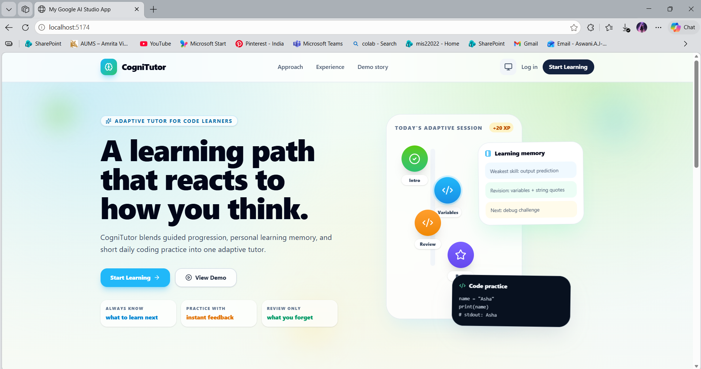

### Register and Login

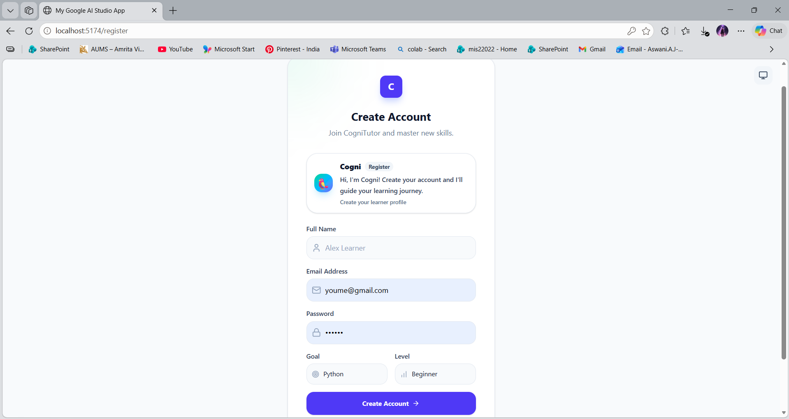

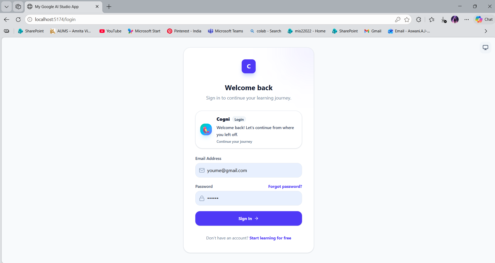

### Learner Dashboard

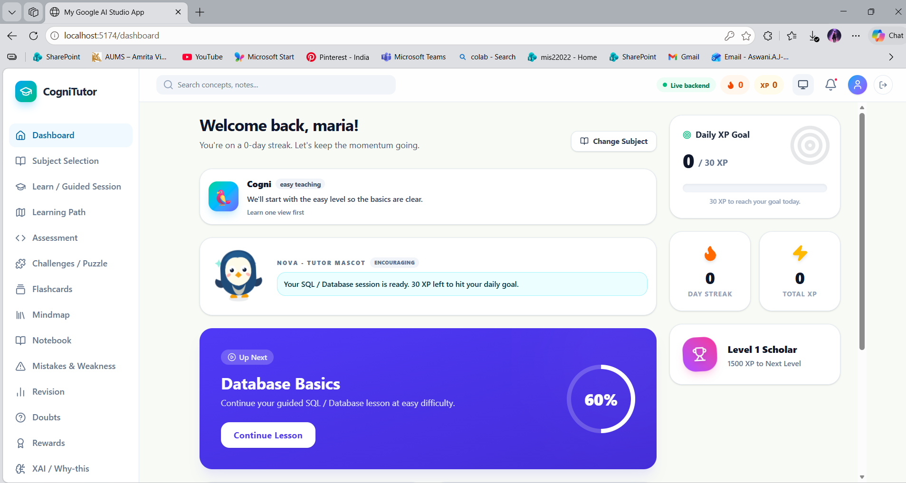

### Guided Lesson

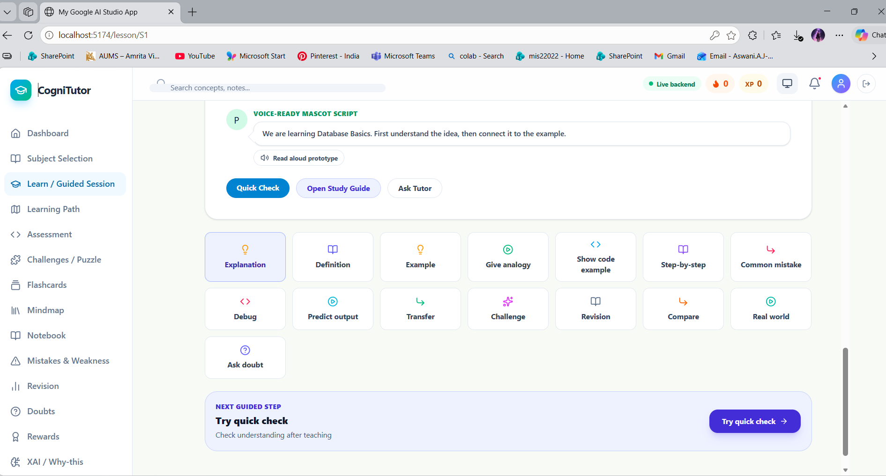

### Dynamic Assessment

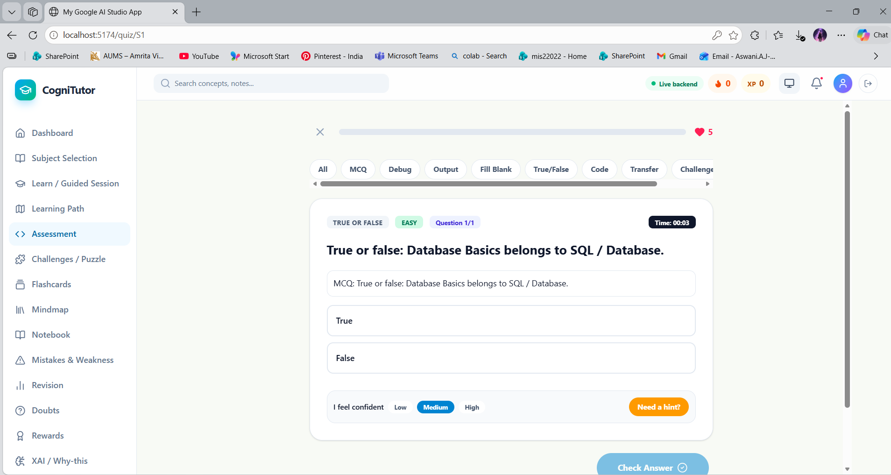

### Answer Feedback and Evaluation

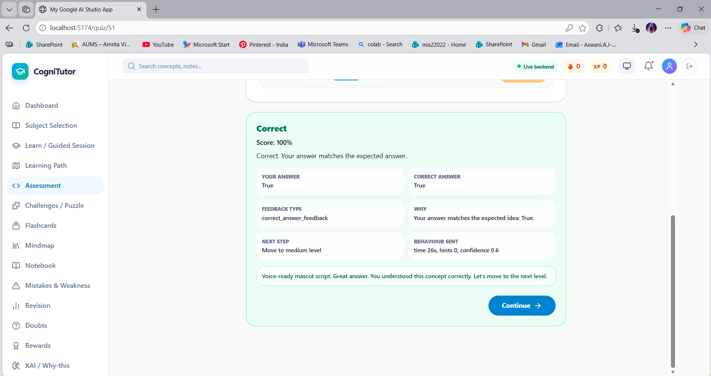

### Learning Path

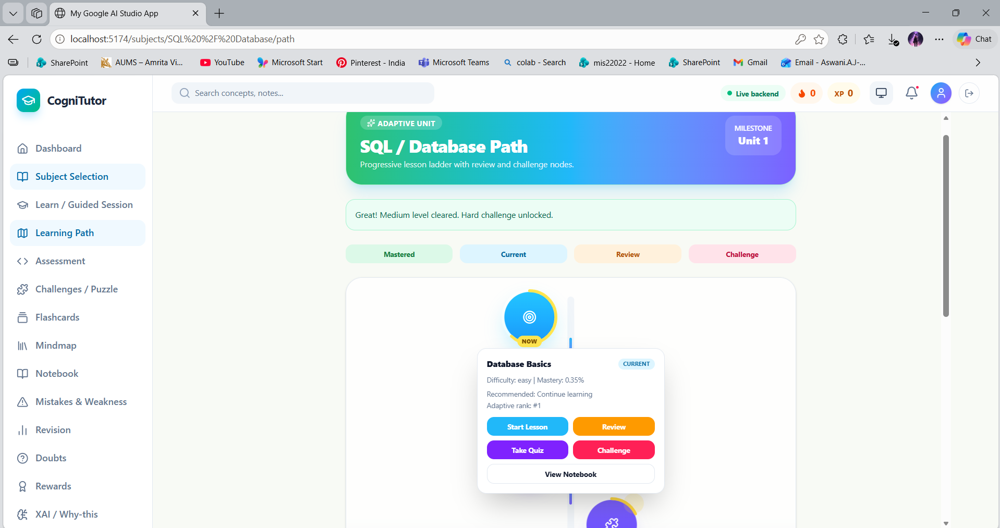

### Notebook Memory and Revision

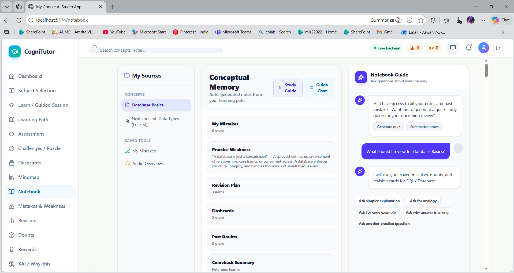

### Flashcards and Mindmap

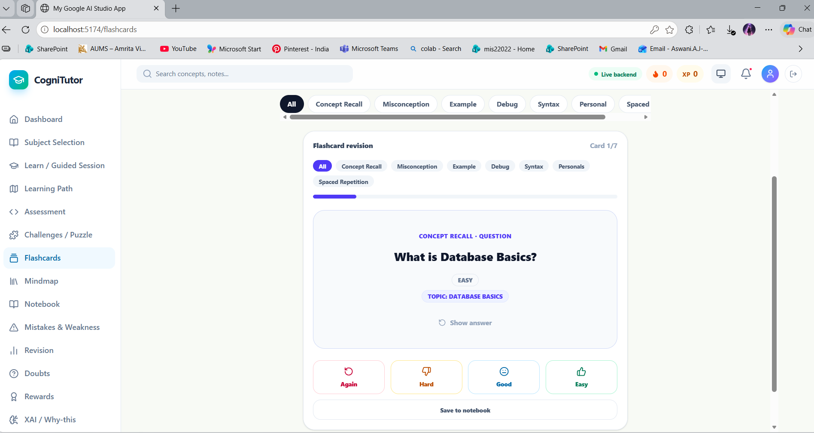

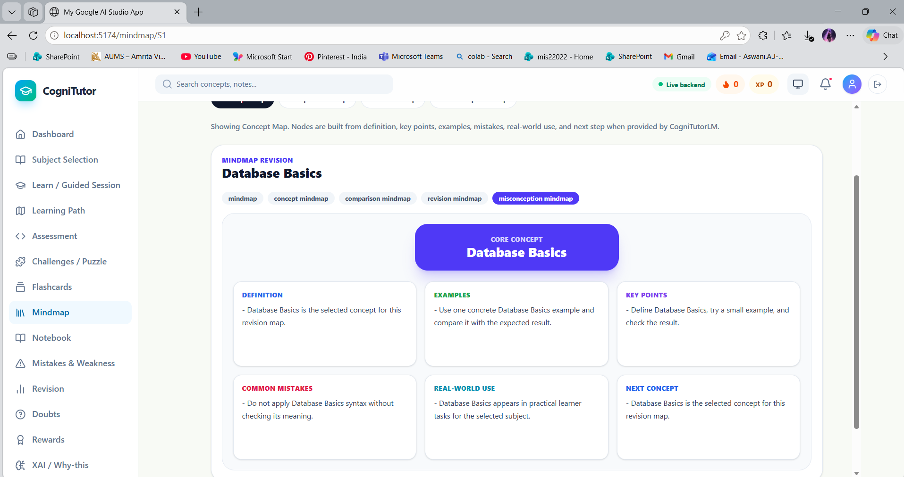

### Doubt Support

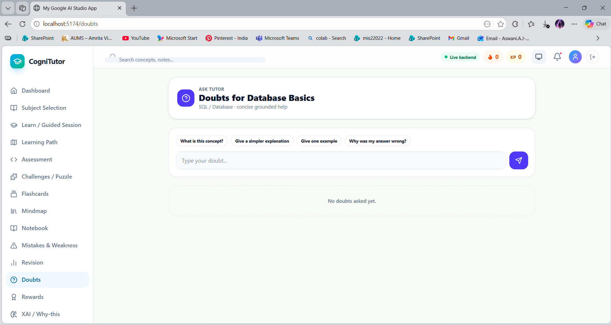

### Mistakes and Weakness Review

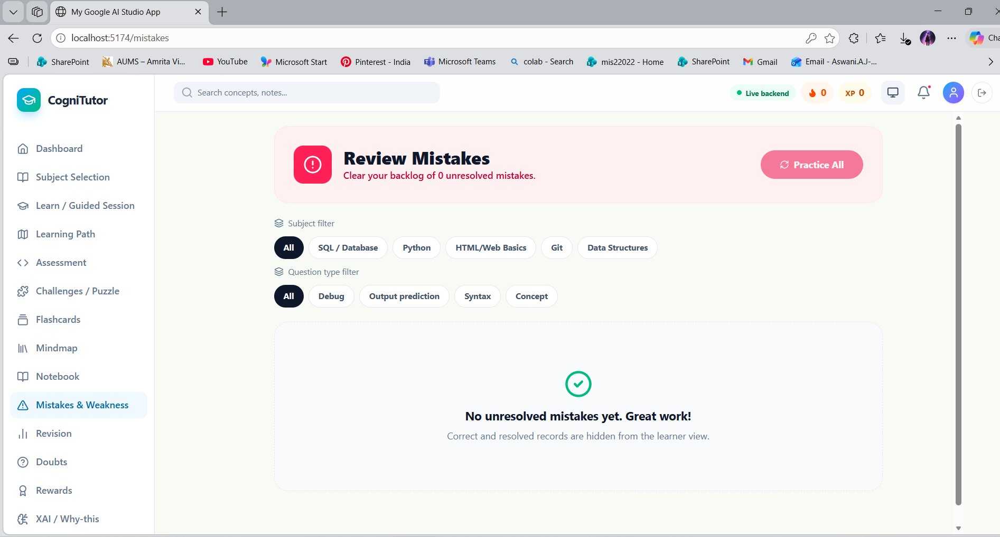

### Rewards and Momentum

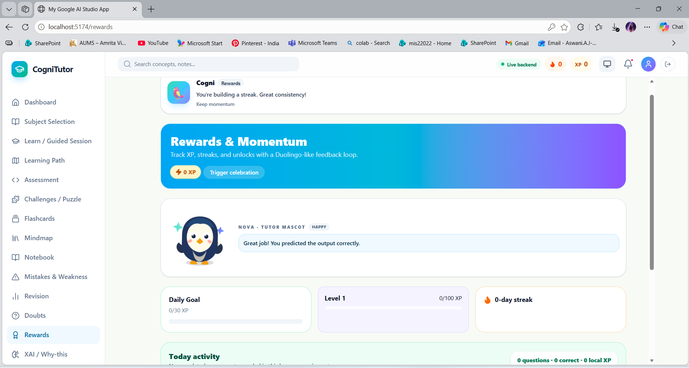

### Developer Evidence Trace

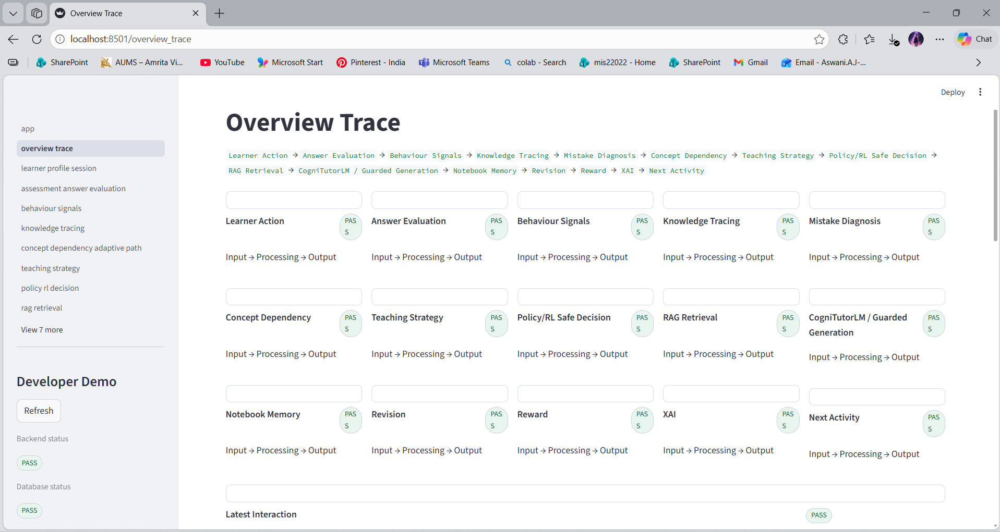

### Developer Assessment Evidence

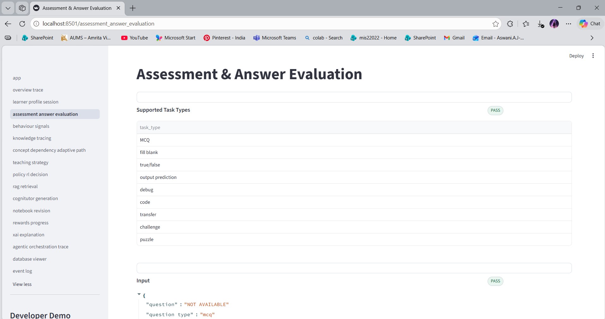

### Developer Notebook Revision Evidence

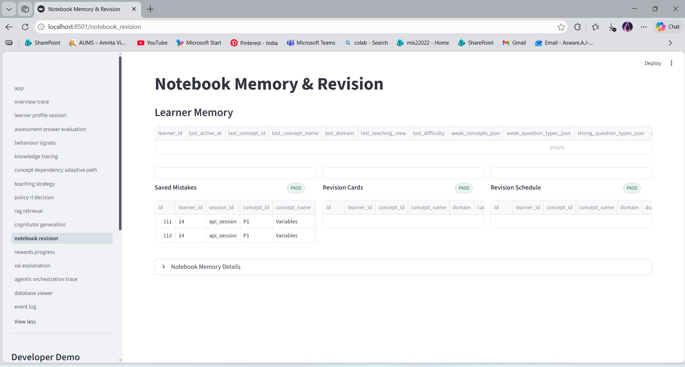

### Safe Code Runner

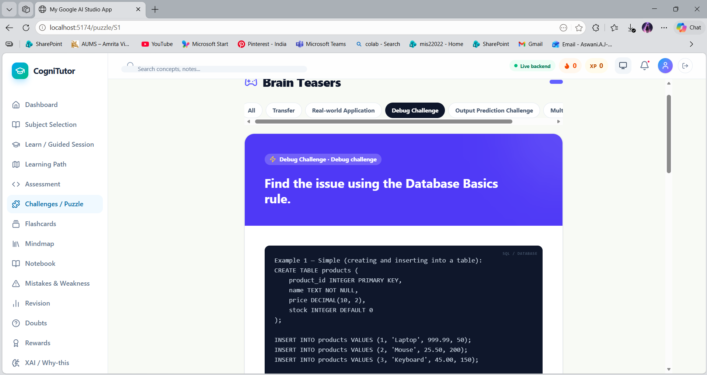

### Evaluation Chart

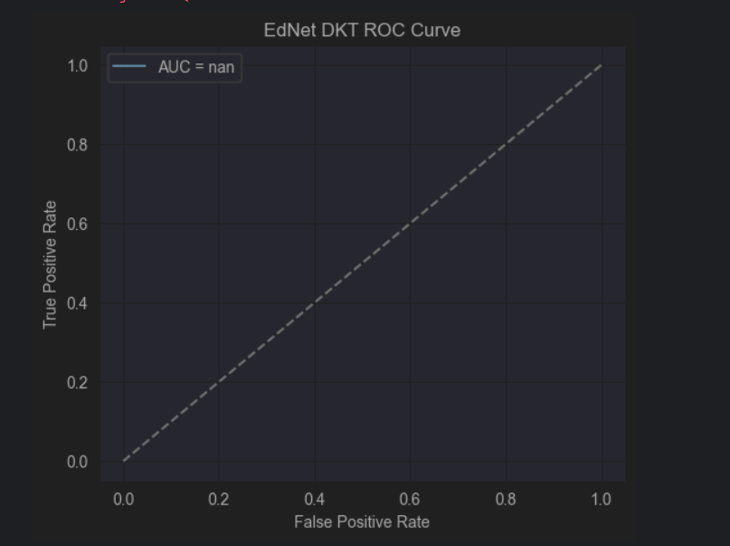

### Suggested Screenshot File Names

```text
docs/screenshots/
├── front_page.png
├── register.png
├── login.png
├── Dashboard.png
├── guided_lesson.png
├── Assesment_true_false.png
├── assesmnet_demo.png
├── feedback_interface.png
├── path.png
├── Notebook.png
├── flashcard.png
├── mindmap.png
├── doubt.png
├── Mistake.png
├── Rewards.png
├── overview_trace.png
├── demo_notebook.png
├── code.png
└── ednet_roc_curve.png
```

## Evaluation Summary

The project includes module-wise and integration-level evaluation evidence.

Main evaluated areas:

- Knowledge Tracing prediction and calibration metrics
- Behaviour Modelling and runtime behaviour-risk verification
- RAG retrieval and grounding metrics
- CogniTutorLM raw vs guarded generation checks
- Answer Evaluation across multiple task types
- Policy/RL unsafe action masking
- Runtime source verification
- Notebook, revision, rewards, and XAI evidence
- Visualization-based evaluation reports

Important interpretation:

The results show framework readiness and module integration behaviour. They should not be interpreted as final proof of classroom learning gain. Large-scale real learner studies, human evaluation, stronger leakage-safe validation, and broader benchmarks remain future work.

## Current Limitations

- No large-scale real learner classroom study yet
- Behaviour labels are proxy interaction labels, not psychological diagnosis
- Raw CogniTutorLM output requires guarded validation and fallback
- Policy/RL is safe decision support, not autonomous learner control
- Safe Code Runner is prototype-level and not production-grade sandboxing
- Some generated/evaluation metrics are internal readiness indicators, not standard learning-gain metrics
- Large datasets and model artifacts are not included in the GitHub repository

## Tech Stack

The project may include the following depending on each module:

- Python
- FastAPI
- SQLite
- PyTorch / TensorFlow / Keras
- scikit-learn
- pandas / NumPy
- React
- Vite
- TypeScript / JavaScript
- Streamlit
- RAG / local retrieval
- Matplotlib / report generation

## Large Files and Artifacts

Large datasets, model checkpoints, trained artifacts, private databases, and environment folders are not meant to be pushed to GitHub.

Examples usually excluded:

```text
.venv/
node_modules/
__pycache__/
.env
*.db
*.sqlite
*.pt
*.pth
*.h5
*.pkl
datasets/
external/
model_artifacts/
checkpoints/
outputs/
```

If a model or dataset is required, document how to regenerate it or where it should be placed locally.

## Suggested GitHub Workflow

Run Git only from the clean root folder:

```powershell
cd "C:\Users\Aswini_Ayappan\PycharmProjects\PythonProject\cognition_adaptive_ai_tutor_personalized_learning_system"
```

Then:

```powershell
git init
git status
git add .
git commit -m "Initial integrated cognition-adaptive tutoring system"
git branch -M main
git remote add origin https://github.com/Aswani1402/cognition_adaptive_ai_tutor_personalized_learning_system.git
git push -u origin main
```

If a remote already exists:

```powershell
git remote -v
git remote set-url origin https://github.com/Aswani1402/cognition_adaptive_ai_tutor_personalized_learning_system.git
```

Before pushing, always check:

```powershell
git status
```

Do not push `.env`, `.venv`, `node_modules`, large model files, private learner data, or large datasets.

## Project Status

Research prototype / final-year project.

The repository demonstrates an integrated cognition-adaptive tutoring framework with learner modelling, grounded generation, safe decision support, memory, revision, rewards, XAI, and runtime evidence.

## Reviewer Questions

### What problem does this solve?

Most learning apps show the same path to every learner. This project solves that by adapting learning flow using mastery, behaviour, mistakes, concept dependencies, answer quality, revision needs, and safe content-generation evidence.

### Can someone run it?

Yes, the project can be run locally in parts: backend API, frontend UI, and developer demo. Large datasets, model checkpoints, runtime databases, and private/generated artifacts are intentionally excluded, so some ML experiments may require regenerating artifacts or placing local files manually.

### What did I build?

An integrated cognition-adaptive tutoring system with FastAPI backend services, React learner UI, Streamlit developer evidence dashboard, CogniTutorLM from-scratch experiments, fine-tuning comparison work, RAG-grounded guarded generation, safe policy/RL support, notebook memory, revision, rewards, and XAI reporting.

### What is completed?

The repository structure, core source modules, local run documentation, module READMEs, GitHub-safe `.gitignore`, learner UI, backend API structure, developer evidence dashboard, and experiment/reporting scripts are organized into one reviewable project.

### What is still limited?

This is an academic prototype, not a production deployment. Some model outputs depend on excluded checkpoints, generated datasets, or local runtime artifacts. Evaluation evidence is project-level and internal; it should not be presented as real-world learning-gain proof without a formal user study.

### Why should a recruiter care?

This project shows end-to-end engineering across backend APIs, frontend integration, ML/NLP experimentation, RAG, model validation, safety-aware decision support, documentation, GitHub hygiene, and honest evidence reporting. It demonstrates the ability to turn a complex AI idea into a structured, reviewable software system.

## Authors

- Aswani A J
- Krishna Prabha S
- Sanvia Saj P S
- Guide: Radhu Krishna R

Department of Computer Science and Engineering  
Amrita School of Computing  
Amrita Vishwa Vidyapeetham, Amritapuri, Kerala, India
