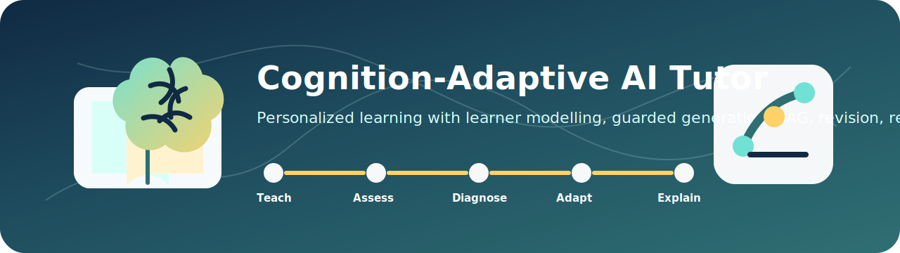

<p align="center">
  
</p>

# Developer Demo and Reviewer Evidence

This folder contains developer/reviewer demo tools for inspecting the Cognition-Adaptive AI Tutor system.

It is used to show evidence that the project is not only a static interface or fixed quiz system. The developer demo helps verify module inputs, outputs, runtime source labels, fallback status, evaluation summaries, charts, traces, and integration behaviour.

## Purpose

The developer demo helps reviewers understand:

- what learner evidence is collected
- which backend modules are triggered
- whether models or fallbacks were used
- what RAG retrieved
- whether generation was raw, guarded, repaired, or fallback
- what answer evaluation returned
- what safe policy decision was made
- what notebook/revision/reward/XAI evidence was stored
- what runtime verification reports show
- what evaluation charts and summaries were generated

## Possible Demo Features

Depending on your implementation, this folder may include Streamlit dashboard, reviewer evidence page, module status viewer, learner-state viewer, database inspection tools, evaluation chart viewer, RAG result viewer, policy safety viewer, XAI explanation viewer, runtime source verification page, and report explorer.

## Suggested Structure

```text
developer_demo/
│
├── app.py                     # Main Streamlit app if used
├── pages/                     # Streamlit pages or dashboard sections
├── components/                # Reusable dashboard UI components
├── reports/                   # Selected reports for viewing
├── charts/                    # Selected charts and figures
├── data/                      # Small demo/sample data only
├── requirements.txt
└── README.md
```

## Setup

From this folder:

```powershell
cd developer_demo
python -m venv .venv
.\.venv\Scripts\activate
pip install -r requirements.txt
```

## Run

If the main file is `app.py`:

```powershell
streamlit run app.py
```

If another file is used, update the command. Examples:

```powershell
streamlit run dashboard.py
```

```powershell
streamlit run reviewer_app.py
```

## What the Demo Should Show

A good reviewer demo should show selected learner or sample session, active subject and concept, current mastery estimate, behaviour risk evidence, mistake type, RAG retrieved context, generation source, validation result, fallback status, policy recommendation, safe action mask result, final next activity, reward update, XAI explanation, and stored logs or reports.

## Evaluation Evidence

The developer demo may show or link to:

- Knowledge Tracing metrics
- Behaviour Modelling metrics
- RAG retrieval and grounding charts
- raw vs guarded generation checks
- policy/RL unsafe action before/after masking
- answer evaluator label distribution
- runtime source verification
- module contribution/readiness summaries

Important: internal readiness scores should be explained as internal summary evidence, not direct proof of learning gain.

## What Not to Commit

Do not commit:

```text
.venv/
__pycache__/
.env
*.db
*.sqlite
large reports/
private learner data/
large datasets/
model artifacts/
cache/
```

If demo data is included, it should be small, anonymized, and safe.

## Status

Reviewer/developer evidence component for a research prototype. It supports transparency, traceability, and demonstration of module integration.

## Reviewer Questions

### What problem does this solve?

The developer demo helps reviewers see what the adaptive tutor is doing internally. It makes module outputs, fallbacks, evidence labels, traces, and reports visible instead of requiring someone to inspect code manually.

### Can someone run it?

Yes, it can be run locally with Streamlit after installing dependencies. For live API status and real interaction traces, the backend should be running first.

### What did I build?

A reviewer-facing Streamlit dashboard that displays adaptive tutor evidence such as learner state, assessment results, behaviour signals, RAG context, generation source, validation/fallback status, policy decisions, rewards, XAI, and evaluation summaries.

### What is completed?

The demo folder, Streamlit app, multipage structure, API/data helpers, run instructions, and reviewer evidence explanation are organized for local inspection.

### What is still limited?

The demo depends on available backend endpoints, local databases, and selected artifacts. It should not fabricate missing outputs; unavailable data should remain clearly labelled as unavailable, fallback, or warning.

### Why should a recruiter care?

This component shows engineering maturity: observability, reviewer transparency, traceability, and the ability to explain how an AI system behaves rather than only showing a polished UI.
